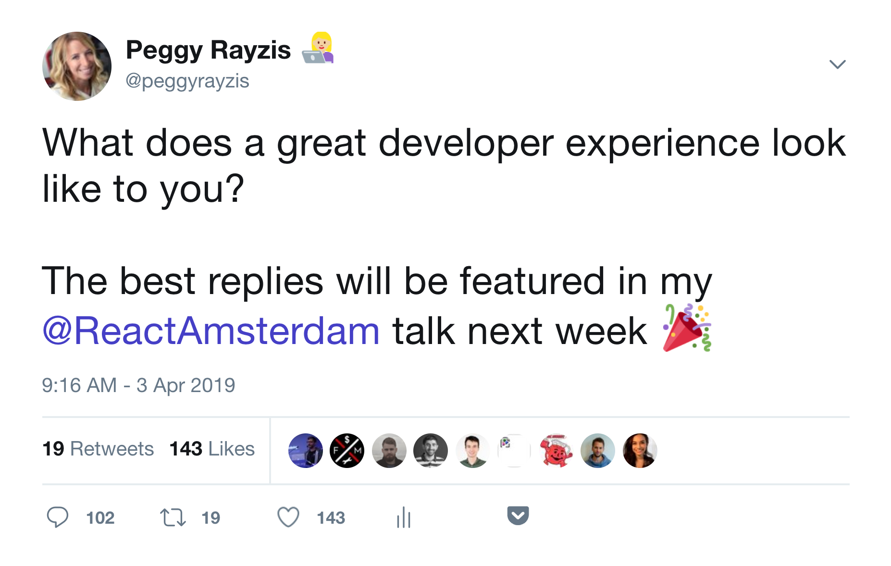

import { Head, Notes, Image, Appear } from 'mdx-deck';
import { Split, Horizontal } from '@mdx-deck/layouts';
import {
  FullScreenBackground,
  AlignLeft,
  LayoutTop,
  TweetSlide,
  WhiteBackground,
  PurpleBackground,
  Emily,
  SplitWhite,
} from './components';

import { colors } from './theme';
export { theme } from './theme';

<FullScreenBackground src="./img/background.svg">
  <AlignLeft>
    <h1>
      The GraphQL
       
      developer experience
    </h1>
    <h2>React Amsterdam 2019</h2>
  </AlignLeft>
</FullScreenBackground>

---

<FullScreenBackground src="./img/peggy.jpg">
  

    <h1 style={{ margin: '10px', color: colors.white }}>@peggyrayzis</h1>
    <h2 style={{ margin: '10px', color: colors.white }}>
      Engineering Manager, Apollo
    </h2>
  

</FullScreenBackground>

---

export default WhiteBackground;

<Emily />

<Notes>
  even if you haven't worked with graphql before, you don't need prior knowledge
  of it to get anything out of my talk
   
   
  the most important thing to remember is that graphql is a way to communicate between
  a client and an api. often times that api is a graphql server, but it doesn't have
  to be. it can even be a local cache!
   
   
  the way you communicate is with a query like the one you see in the middle.
  the client requests the query and the api returns back one response in exactly
  the same shape
</Notes>

---

export default PurpleBackground;

<h2 style={{color: colors.lilac}}>This is not a typical GraphQL talk.</h2>

<Notes>
  i've seen a lot of graphql talks before, and now it's about that time where
  someone will either compare it to rest or maybe go through some of the
  technical benefits.
   
   
  i'm not going to do that today because i want to take a different angle on graphql
  that you might have not seen before. graphql is not about data over the wire.
</Notes>

---

# GraphQL is not about:

- Smaller payloads
- Fewer client/server roundtrips
- Preventing overfetching

<Notes>
  it's not about smaller payloads, or fewer roundtrips, or preventing
  overfetching. yes, these are technical benefits of graphql but to me, they're
  not the most compelling reasons to adopt graphql
   
   
  instead, i think the best part about graphql is the massive productivity boost
  it brings to developers
</Notes>

---

export default SplitWhite;

<h2 style={{textAlign: 'center'}}>GraphQL is about helping developers be more productive!</h2>

  
  <Emily />

<Notes>
  the excellent developer experience is where graphql really shines, and it's
  the reason why your team should adopt it.
   
   
  maybe this is controversial, you're probably wondering why should we make a serious
  technical decision based on DX? shouldn't we be optimizing for the user experience
  instead?
   
   i think developer happiness and productivity is so important because it helps
  us ship products faster, it attracts the best engineers to our teams, and it helps
  us to retain engineers once they join.
</Notes>

---

# What does great DX look like?

<Notes>
so what does great developer experience look like?

</Notes>

---

<FullScreenBackground src="./img/konmari.jpg">
  <h1>Great DX should spark joy!</h1>
</FullScreenBackground>

<Notes>
  In the words of the great Marie Kondo, great DX should spark joy! And while
  it's not always possible to KonMari your developer tooling and get rid of the
  ones you hate (webpack), you can make more informed choices for future
  technologies
   
   
  so what does it mean for a developer tool to spark joy? after all it is a little
  subjective. even though i manage a DX team, i don't have all the answers so i took
  it upon myself to do some research
</Notes>

---

<Notes>
  i conducted a super scientific poll on twitter and added in some bribery for
  good measure to get some responses
   
   i was super impressed by the quality of the responses! i read every one,
  and it was really awesome to hear what good DX meant to you, so thanks if you
  participated. there were a lot of common themes that came up:
</Notes>

---

export default LayoutTop;

<TweetSlide title="Nonobtrusive, out of the way" start={1} end={2} />

<Notes>
  The most common by far was that tools shouldn't get in your way as your
  developing. Ideally, they should be as nonobtrusive as possible so you can
  focus on the code
</Notes>

---

export default LayoutTop;

<TweetSlide title="Predictable and intuitive" start={3} end={4} />

<Notes>
  They also should be predictable, so given the same inputs you'll receive the
  same output. The API should also be intuitive enough for you to fall into the
  pit of success
</Notes>

---

export default LayoutTop;

<TweetSlide title="Instant feedback loop" start={5} end={6} />

<Notes>
  And while we want our tools to get out of our way as much as possible, we also
  want them to tell us immediately if there's a bug or an error. the closer the
  feedback is to our editor, the better the experience will be
</Notes>

---

<Horizontal>
  

    
    <h3>Nonobtrusive, out of the way</h3>
  

  
  <h3>Predictable and intuitive</h3>

  

    
    <h3>Instant feedback loop</h3>
  

</Horizontal>

<Notes>
  a lot of you also mentioned specific tools that fit these principles. remember
  the first time you used prettier? it was amazing! all of a sudden i could
  write some janky unindented code, hit save and it magically fixed it for me!
  it's never something you think about anymore
   
   i also think react does a nice job of being predictable -- your ui is a
  function of your props plus state. finally, we have vscode and typescript,
  which are amazing together giving you instant feedback about the code you're
  writing. i think another thing these tools all have in common is that they
  filled a void in developer's lives
</Notes>

---

export default PurpleBackground;

<h2 style={{color: colors.lilac}}>Developers love tools that solve problems.</h2>

<Notes>
  tools with a great developer experience solve problems.
   
  this is exactly the way i felt when i first learned graphql. it took a couple
  weeks to get my ahead around it, but once i did, it was amazing to see how
  much more productive i became. that's because it solved a real problem
</Notes>

---

export default Split;

<h1 style={{textAlign: 'center'}}>We write a lot of data fetching code.</h1>

<Notes>
  Data fetching in React is not the best experience, and that's because we have
  to write a lot of manual code that often makes up most of our app. adam, an
  engineer at airbnb, said that 90% of their 2 million line codebase is
  dedicated to styling and data fetching
   
   
  and if the majority of our time is spent data fetching, then that's probably where
  we should start if we want to improve the frontend development experience
</Notes>

---

export default Split;

## You need a data layer:

- What's the shape of my data?
- How do I track loading and error states?
- How do I cache it?

<Notes>
  to get the most out of react, you really need a data layer. here's an example
  of some data fetching code with hooks. i think hooks are great, and they're a
  definite improvement over the class component model when it comes to
  reusability, but they don't solve the data fetching problem
   
   
  when i look at this code, a couple questions come to mind.
</Notes>

---

## We spend too much time trying to make an event emitter behave like a data cache.

<Notes>
  when people need a cache, they usually take their data fetching code and dump
  it into redux. but redux, at it's core, is just a simple event emitter. to get
  it to behave like a cache, you have to layer a bunch of middleware and
  packages like normalizr, and selectors, and write a lot of code. same thing
  goes for context, that was designed to solve the problem of passing down props
  multiple levels. it's not a cache and when your provider unmounts, all of your
  data disappears with it. it's also really easy to cause performance problems
  if you don't enforce certain guidelines. what you really need is a cache.
</Notes>

---

export default Split;

<Appear><h2 style={{padding: '30px', textAlign: 'center'}}>I promise that I won't put all my UI state into my cache.</h2></Appear>

<Notes>
  Some people can go overboard and put all of their data into the cache,
  especially UI state that shouldn't be there. so i want everyone to raise their
  hand and repeat after me.
</Notes>

---

<FullScreenBackground src="./img/background.svg">
  <h1 style={{ color: colors.black }}>
    If we optimize the data layer,
     
    can we improve DX?
  </h1>
</FullScreenBackground>

<Notes>
  i think the key to improving our lives as react developers is optimizing the
  data layer, since it's where you spend most of your time. it's also about
  choosing the right tools for the job, like a data cache. if we can do those
  two things, then can we improve DX? with graphql, i think we can.
</Notes>

---

<FullScreenBackground src="./img/dogscared.jpg">
  

    <h1 style={{ margin: '10px', color: colors.white }}>Demo time!!</h1>
    <a href="https://github.com/peggyrayzis/redux-to-graphql">
      <h3 style={{ margin: '10px', color: colors.lilac }}>
        https://github.com/peggyrayzis/redux-to-graphql
      </h3>
    </a>
  

</FullScreenBackground>

<Notes>
  i can show you better than i can tell you, so the next part of this talk is
  going to be some live demos so you can see for yourself that apollo is that
  missing piece that makes react come to life.
</Notes>

---

export default Split;

<h1 style={{textAlign: 'center'}}>Do more with 40% less code.</h1>

---

export default Split;

<h1 style={{textAlign: 'center'}}>Prediction: Our data layer will become smarter over time.</h1>

---

export default WhiteBackground;

<Emily />

---

export default SplitWhite;

<h1 style={{textAlign: 'center'}}>Let's GraphQL together!</h1>
<h2 style={{textAlign: 'center'}}>@peggyrayzis</h2>

  
  <Emily />

